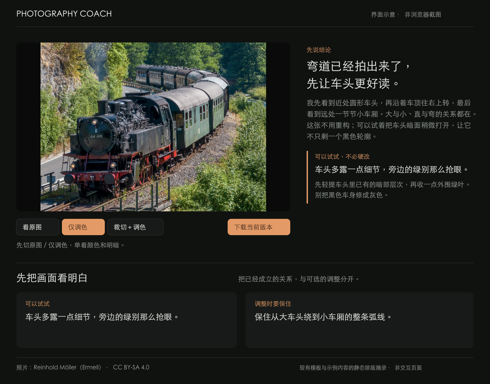
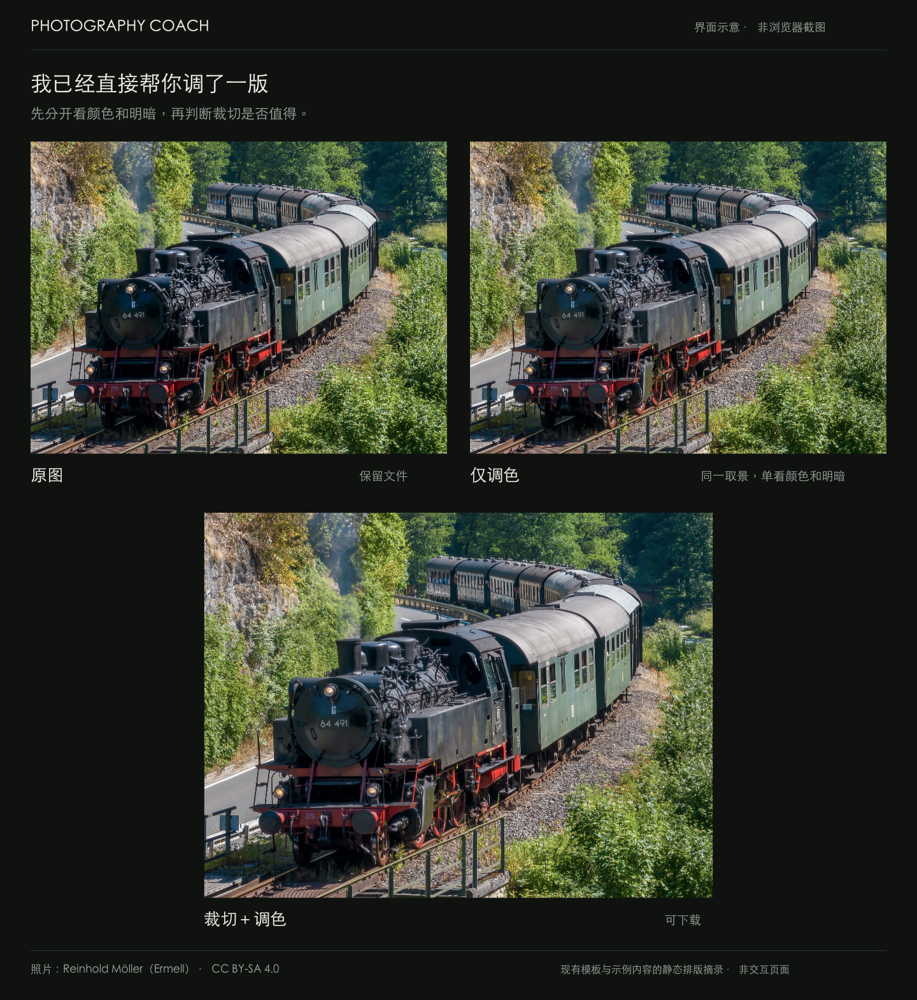

# Photography Coach · 摄影教练

**让每次拍摄，都有一个具体的下一步。**

一个在 Codex 中使用的摄影教练：从你的一张照片出发，指出值得保留的地方、最值得调整的问题，给出重拍方法、调色对照和真正相关的优秀作品参考。

[界面预览](#界面预览) · [开始使用](#开始使用) · [反馈长什么样](#反馈长什么样) · [怎么看调整](#怎么看调整) · [验证进展](#验证进展) · [开发文档](docs/development.md)

> 当前为研究原型，交付形态是 **Codex 技能 + 本地视觉报告**，不是独立 App 或在线评图网站。评分用于辅助练习，不是客观审美排名；摄影质量仍在验证中。

## 界面预览

先看照片和一句结论，再区分“可以调整什么”与“应该保住什么”。版本切换和下载紧挨照片，便于边看边对照。



*基于现有报告模板和列车示例内容绘制的静态界面示意，非浏览器截图；布局与文案作了摘录，不代表新的交互实测。图中的照片为已有实际调整文件，不是生成式重画。*

示例摄影：Reinhold Möller（Ermell），[原图来源](https://commons.wikimedia.org/wiki/File:Behringersm%C3%BChle_Dampfeisenbahn-20220731-RM-111152.jpg)，[CC BY-SA 4.0](https://creativecommons.org/licenses/by-sa/4.0/)。本页两张示意图同以 CC BY-SA 4.0 提供，改动与署名详见[图像说明](docs/images/README.md)；摄影师未背书此项目或调整。

## 为什么做这个项目

看了很多摄影视频，轮到自己的照片，还是不知道哪里不对。

“构图不错”“故事感不够”“主体再突出一点”都像点评，却很难变成下一次按快门时能做的事。Photography Coach 希望把这一步讲清楚：**在哪里、为什么、怎么改，以及改完会失去什么。**

它适合想通过自己的照片练习的摄影爱好者。你不需要先选出大师作品，不需要邀请专家，也不必先解释“我想表达什么”。从一张可查看的照片开始就可以。

## 反馈长什么样

以下是表达方式的示意，不是某张照片的完整评测或效果证明：

> 先别裁。人物旁边的亮墙更抢眼，但左边那条走道也交代了他站在哪里。
>
> 可以先只压一点墙面的亮度，让视线回到脸上。停在墙仍然比衣服亮的时候，不要把它压成灰色。这样会少一点原来的明快感，但不用牺牲环境。
>
> 下次在类似场景里，固定位置和取景，等人物转头，让脸与墙的明暗边界更清楚，再拍一张对照。

完整反馈还包括：

| 你会看到 | 帮你解决什么 |
|---|---|
| 第一判断与一个重点 | 先做哪件事；如果画面已经成立，也会明确说不必硬改 |
| 全画面看片地图 | 不只看人物，还看周围物体、边缘、线条、明暗、虚实、大小远近和关系 |
| 八维评分与理由 | 用分数区间定位短板，每项对应画面证据，不合成一个总分 |
| 重拍动作与后期方案 | 区分现场能解决的事和当前文件能调整的事，说明效果与代价 |
| 一张具体作品参考 | 给出直达链接，说明看哪里、学什么、哪些地方不能照搬 |
| 一次小练习 | 用 20–40 分钟只练一个变量，再带着新照片回来复盘 |

观察范围不限于一套固定清单。风景、街拍、人像、静物中的关键关系不同；教练先检查全画面，再选择最值得讲清楚的部分。**重点要突出，观察不能只剩一个点。**

## 开始使用

### 1. 安装技能

需要能查看图片的 Codex 环境和 Git。以下命令适用于 macOS / Linux 的默认技能目录：

```bash
git clone https://github.com/judefluen-coder/photography-coach.git \
  ~/.codex/skills/photography-coach
```

已有同名目录时，不要直接覆盖本地改动。安装后重新打开一个 Codex 任务。

### 2. 附一张照片，发出请求

```text
请使用 $photography-coach 点评这张照片。
看完整个画面，保留评分，但把重点讲清楚：哪里已经成立，最值得改什么，下一次怎么拍。
请用通俗的话，并给一张真正相关的优秀作品参考。
```

标题、EXIF、拍摄经过、按快门的理由都不是必填项。只有截图或低清图片时，细节判断会受限，教练应明确说明。

### 3. 想看成片，就要求输出对照

```text
请直接做出调整后的图片，并生成可打开的视觉报告。
保留原图，单独给一个不裁切的仅调色版；如果裁切确实有帮助，再另给裁切＋调色版。
告诉我每一步改善了什么、牺牲了什么，不要改变照片里的人物和物体。
```

核验参考作品需要网络访问；生成调整图需要可用且获授权的图像处理工具。技能本身不附带模型或修图服务。条件不具备时，应提供建议并说明限制，不能用原图或生成式近似图冒充修好的成片。

## 怎么看调整

调色和裁切解决的是不同问题，应该分开看。

| 版本 | 看什么 |
|---|---|
| 原图 | 留作判断依据，避免越修越忘记原来的关系 |
| 仅调色 | 保留原取景，只比较曝光、明暗层次和颜色 |
| 裁切＋调色 | 在同一调色基础上，判断收紧边缘是否值得失去那些环境 |



*同一列车示例的实际三版本文件：仅调色轻提车头暗部、收敛外围亮绿；裁切版另去掉顶部和右侧少量环境。两张上方图片保持相同展示比例。此处为静态界面示意，点击图片可查看大图，按钮不能在 README 中操作。*

页面只展示实际提供的版本，不强制裁切。旧报告只有“原图 / 调整后”时也可以查看，但会说明没有独立调色对照。

你还可以：

- **在原图上看点评位置**，对照物体间距、线条和明暗关系；
- **显示或隐藏裁切框**，看清建议保留的范围；
- **下载当前版本的完整图片**，而非页面缩小预览；
- **复制练习说明**，和新照片一起发回 Codex，继续复盘。

报告是生成到本机的 `index.html` 和配套 `assets/`。保存或转移时请保留整个文件夹。目前仓库没有公开在线演示，也不附带用户照片；**报告页本身不会接收上传、调用模型或自动修图。**

## 参考作品为什么值得看

“也是街拍”“颜色很像”“出自大师”都不足以构成推荐理由。

教练先判断你的照片需要解决或保留什么，再找具体作品：例如背景怎样衬托暗色主体、多人之间怎样形成分组、边缘遮挡怎样保留空间。每个参考都应说明：

1. **共同之处**：两张图的哪一处关系可以拿来比较。
2. **观看任务**：花几十秒，具体看哪里。
3. **不能照搬的地方**：场景、光线或表达目的有什么差别。
4. **可迁移的练习**：下次如何试一次。

本地 150 张单图卡是检索起点，**不是推荐上限**。没有合适的本地作品时，可继续检索外部来源并核验。默认给一张；找不到可靠匹配就说明缺失，不用不相关的名作填空。受版权限制的作品只提供核验后的链接。

## 判断依据与边界

教练结合可追溯的摄影课程、博物馆与档案、摄影师经验、教育者内容及技术资料，按照片中的证据作判断。资料规模不等于权威性，模型也可能看错物体、方向或人物关系。

- **先保护，再调整。** 暗、虚、斜、留白和遮挡不自动等于错误；建议应说明实际损失和修复代价。
- **有分数，但不排名。** 八维采用 0–5 的整数区间，每项给理由；不生成总分，不拿不同题材排高低。
- **后期要忠实。** 允许摄影后期中的裁切、曝光、颜色与局部明暗等调整；不凭空增删、替换或重排人物和物体。
- **不知道就说不知道。** 不靠外貌或画面猜身份、关系、地点、拍摄意图和因果。补充背景可以改变表达判断，不能改写像素事实。

八个评分维度及具体规则见[评价标准](references/evaluation-standard.md)；完整输出要求见[点评格式](references/response-card.md)。

## 验证进展

以下是 **2026-09-14** 的项目状态，不是实时 CI 徽章，也不是摄影准确率：

| 验证对象 | 当前证据 | 不能证明什么 |
|---|---|---|
| 代码与数据流程 | 156 项自动化测试通过，知识结构校验通过 | 点评一定准确、修图一定好看 |
| 规则校准 | 24 张答案可见样本；其中 13 张复核 | 独立盲测通过率 |
| 新图查错 | 12 张冻结答卷，72 条分项引用证据 | 代表所有摄影场景或证明修订后水平 |
| 示例页面 | 项目使用者已确认本轮示例 | 跨浏览器、全屏幕和所有报告均已验证 |

**正式发布质量门槛尚未通过。** 旧 v4 / v5 结果因图像身份或评分证据问题已作废，不能作为宣传指标；修订后的行为尚未在另一批独立新图上验证。自动化交互检查使用 DOM 测试替身，定位、裁切框和复制练习还缺完整的点击回归覆盖。

进一步核对：[24 张校准](references/calibration-review-20260914.json) · [12 张查错](references/forward-review-20260914.json) · [阶段复核记录](references/gpt6-final-review-20260914.md) · [发布评测方法](references/benchmark-method.md)

阶段复核记录保留了当时的 148 项测试和待页面验收状态；后续三版本实现增加 8 项测试，使用者随后确认示例。公开审查记录包含原句和哈希，但本轮完整图片、答卷及运行包未全部公开，不是下载仓库即可完整复现的实验。

## 常见问题

**我不懂摄影，怎么判断它说得对不对？**

先看它能否指向具体位置，再做一次只改变一个变量的对照。你可以追问“如果不这样改，有什么好处？”或“这个建议可能破坏什么？”。解释听起来专业，不代表判断正确。

**这能代替摄影课程或专业老师吗？**

目前不能这样承诺。它适合围绕自己的照片持续练习；没有独立专家认证，也没有证据证明长期学习效果。

**照片是不是完全留在本地？**

生成的报告保存在本地，但使用 Codex、模型或外部工具处理照片时，数据处理范围取决于对应服务和权限。本项目不承诺全离线。不要在 Issue 或仓库中提交私人照片、敏感信息或未获授权的图片。

## 开发与参与

想调整规则、生成报告或运行验证，请看[开发指南](docs/development.md)。核心入口：

- [技能工作流](SKILL.md)
- [完整性六检](references/integrity-preflight.md)
- [参考作品匹配规则](references/reference-policy.md)
- [视觉报告字段与约束](references/visual-report.md)
- [知识库状态](references/knowledge-status.json)

最有帮助的反馈是具体错例：**原话是什么、图中哪里与它矛盾、建议执行后会损失什么。** 欢迎在 [Issues](https://github.com/judefluen-coder/photography-coach/issues) 提交错误点评、参考图匹配问题、中文表达建议或可复现的页面问题。图片请只使用有明确公开授权的材料；修改评测时需保留原答卷与证据，不把已参与调参的样本继续称为独立盲测。

## 许可证

除[两张界面示意图的单独许可](docs/images/README.md)外，仓库目前尚未指定开源许可证。公开可见不代表已提供开源授权；使用、修改或再分发的许可事宜，请先与维护者确认。第三方摄影作品另受各自的许可证或版权条件约束。
