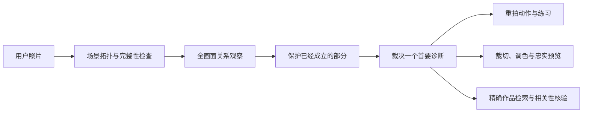

# Photography Coach · 摄影教练

> 给一张照片，不只说“好看”或“不好看”：指出画面真正成立的地方、最限制它的问题，以及下一次应该怎么拍。

Photography Coach 是一个面向 Codex 的摄影点评技能。它把全画面观察、摄影知识、可执行练习、忠实的裁切调色预览，以及经过核验的优秀作品参考，组织成一次能继续练习的反馈。

**当前状态：研究原型。知识库已达到预设覆盖量，但尚无通过发布门槛的有效盲测结果，不应被宣传为“客观审美评分器”或摄影专家替代品。**

## 它解决什么问题

常见的照片反馈要么只有情绪价值，要么堆满术语，却没有告诉拍摄者下一步做什么。Photography Coach 试图回答四个更具体的问题：

1. 这张照片已经有什么成立，不应该被“优化”掉？
2. 全画面里，哪个问题最影响表达？
3. 在同一场景中，下一次如何移动、等待、取景或用光？
4. 哪一张具体作品值得对照学习，究竟看它的什么？

它不是套用固定构图法则。人物、背景、边缘、明暗、色彩、虚实、尺度、距离、动作、时机、信息和意义都会按画面实际情况进入判断；最后只保留一个首要诊断。

## 你会得到什么

- 一句直白的第一判断，以及一个应当保留的优点；
- 全画面点评：主体之外也检查周围物体、四边、线条、空间层次和人物关系；
- 八个维度的可见分数区间，每项都附这张图里的证据；
- 一个首要问题，或明确说明“这张图不需要结构性重做”；
- 同场景可执行方案：动作、预期效果、代价和现场是否可做；
- 具体的裁切与调色参数；在技术条件允许时，直接输出忠实的调整后图片和视觉报告；
- 一个 20–40 分钟的针对性练习；
- 一至两张精确作品参考、直达链接和明确的观看任务。

参考图不受本地收藏数量限制。系统会先检索 150 张已核验的单图卡片；如果没有与首要诊断机制真正匹配的作品，再检索并核验网络来源。找不到强匹配时宁可不推荐，不用名气或题材相似凑数。

## 快速开始

### 1. 安装到 Codex

```bash
git clone https://github.com/judefluen-coder/photography-coach.git \
  ~/.codex/skills/photography-coach
```

重新打开一个 Codex 任务，附上一张可查看的照片，然后输入：

```text
请使用 $photography-coach 点评这张照片，告诉我最需要改什么，以及下一次在同一场景怎么拍。
```

如果希望直接看到调整后的版本：

```text
请给我完整点评，并直接输出忠实的裁切调色成片和可打开的视觉报告。
```

标题、EXIF、拍摄经过和“为什么按下快门”都不是必填项。没有上下文时，教练只依据画面中可见的关系判断，并把身份、地点、事件、意图和因果保持为未知。

### 2. 可选：运行本地分析工具

结构校验只依赖 Python 标准库；图像完整性分析与 benchmark 物化需要 Pillow。

```bash
python3 -m pip install Pillow
python3 scripts/analyze_image_integrity.py /absolute/path/to/photo.jpg
```

量化结果只用于提示哪些区域值得复核，不会自动决定照片好坏或首要问题。

## 一次点评如何形成



这里的“忠实预览”只允许裁切、旋转、透视、曝光、色彩和局部明暗等摄影后期调整；不能凭空新增、删除、替换或重排人物和物体。若需要生成式改图，必须与摄影建议图明确分开。

## 设计原则

- **证据先于结论。** 每个判断都必须能指回图中的位置、关系或可见损失。
- **先保护，再修改。** 优秀照片不因为偏离模板就被强行拉直、提亮或居中。
- **优先级只有一个。** 罗列十个小问题不等于有效指导。
- **参考靠机制匹配。** 不因“大师”“获奖”或同题材就自动相关；推荐必须说明两张图共享什么问题，以及不可照搬什么。
- **评分不是审美排名。** 八维分数是带不确定性的诊断区间，不生成总分、排行榜或伪客观结论。
- **不知道就明确说不知道。** 不从外貌、服饰、场景或文件名猜测身份、关系、地点、情绪和故事。

## 知识与证据

2026-09-11 复核更正：本地 v5 回答包已有 180 条记录，但随后生成的评分存在批量默认赋值，行动质量、参考质量、评分依据统一满分，无依据推断统一为零。因此该报告中的 81.11%、普通照片 100% 和零幻觉等指标不能作为质量结论或发布依据。需逐例补充回答原句、图像定位和裁决理由后重新评定；既有回答及原始评分保留作审计记录。

2026-09-14 完成了一组 24 张的答案可见诊断校准，逐条绑定图片 SHA-256、回答原句与画面位置。它发现了漏判全局滚转、把局部损失扩大成全幅失败、把自然遮挡误判为结构问题、以及测试答案本身过度确定等问题，并据此收窄规则。该组是有目的的开发样本，不是独立盲测，不能换算为通过率。记录见 [`calibration-review-20260914.json`](references/calibration-review-20260914.json)。

GPT-6 随后复核了其中 9 张争议/动作样本和 4 张保护性样本，发现并纠正了审查记录中的倾斜方向、遮挡对象定位和未经测量的角度比较；也确认“诊断对了”不代表“修复方向给对了”。24 条记录现在同时绑定回答文件哈希。随后在用户授权下，由一位干净上下文的 GPT-5.6 Sol 独立写完 12 张新图点评，再由前台 GPT-6 逐项核图、核引用。发现了重复物数量、截断位置、修复建议前提和评分理由等具体问题，原答卷未改写。详见 [`forward-review-20260914.json`](references/forward-review-20260914.json)。

**148 项自动化测试通过，不等于摄影质量通过。** 本轮收窄了相应规则，尚未在另一批新图上验证修订后的行为；桌面/窄屏交互也未实测。12 张是有目的的小规模查错，不发布通过率，不替代完整发布评测。交付与限制见 [`gpt6-final-review-20260914.md`](references/gpt6-final-review-20260914.md)。

当前界面支持点评区域定位、原图上的裁切框、原图与已有调整版切换和下载、评分不确定性说明，以及复制练习复盘说明。页面仍是本地报告，不包含自动上传评图服务；实际调整版需要先完成图像编辑与核对。

截至 2026-09-09，仓库包含：

| 资产 | 数量 | 用途 |
|---|---:|---|
| 来源记录 | 103 | 课程、博物馆/档案、摄影师一手经验、技术与伦理标准 |
| 已逐项核验来源 | 93 | 支撑可追溯的摄影知识 |
| 精确单图参考 | 150 | 本地检索起点，不是推荐上限 |
| 可证伪点评规则 | 55 | 包含反例条件、动作和练习 |
| v5 正式盲测计划 | 180 张 | 六类题材、三种质量角色、六种受控损坏 |
| 独立真实压力集 | 40 张 | 模拟手机、压缩、暗光、复杂场景和特殊画幅；不计入发布分 |

先前的 v4 测试因复用了与当前 case 身份错位的旧物化图片而被正式作废：100 张中有 97 张来源身份不匹配，因此原始分数只作为流程事故记录，不能证明模型能力。详情见 [`benchmark-report.json`](references/benchmark-report.json)。

v5 曾冻结历史来源排除、候选池哈希、180 张配额、损坏参数和发布阈值；其回答已生成，但评分证据无效，且样本已参与规则校准，现属开发材料。不能通过重评旧样本把它恢复为新版的独立盲测。2026-09-14 的 12 张前向检查在答题前冻结题目与教学快照、答题后冻结原回答，再作逐例审查；它也不替代发布标准要求的完整、来源隔离评测。排除了已知历史来源，不等于排除了模型预训练见过图片的可能。

## 仓库结构

| 路径 | 内容 |
|---|---|
| [`SKILL.md`](SKILL.md) | 技能入口、工作流、输出要求与安全边界 |
| [`references/evaluation-standard.md`](references/evaluation-standard.md) | 自适应观察模型与决策规则 |
| [`references/integrity-preflight.md`](references/integrity-preflight.md) | 场景拓扑、六类技术检查与保护门 |
| [`references/response-card.md`](references/response-card.md) | 对话版与审计版输出合同 |
| [`references/reference-policy.md`](references/reference-policy.md) | 精确作品检索、相关性与版权规则 |
| [`references/source-registry.jsonl`](references/source-registry.jsonl) | 可追溯来源登记 |
| [`references/masterwork-cards.jsonl`](references/masterwork-cards.jsonl) | 精确单图教学卡片 |
| [`references/critique-patterns.jsonl`](references/critique-patterns.jsonl) | 点评模式、反例、动作和练习 |
| [`references/benchmark-method.md`](references/benchmark-method.md) | 来源隔离盲测与发布门槛 |
| [`references/calibration-review-20260914.json`](references/calibration-review-20260914.json) | 24 张答案可见诊断校准及逐例证据 |
| [`references/forward-review-20260914.json`](references/forward-review-20260914.json) | 12 张前向查错：72 条分项证据、冻结哈希与具体参考图复核 |
| [`references/benchmark-v5-plan.json`](references/benchmark-v5-plan.json) | 历史 180 张 v5 预注册计划，现用于审计 |
| [`scripts/`](scripts/) | 检索、图像探针、报告渲染、数据校验与盲测工具 |

完整 benchmark 图片和工作包不会提交到仓库；Git 只跟踪来源身份、许可证元数据、变换、答案键哈希、冻结响应、评分与报告。

## 验证

运行完整结构测试：

```bash
python3 -m unittest discover -s scripts -p 'test_*.py'
python3 scripts/validate_knowledge.py
```

发布校验更严格：

```bash
python3 scripts/validate_knowledge.py --release
```

它目前仍会失败，因为旧报告已经作废，12 张前向查错也不满足完整发布门槛。结构完整不等于效果已经得到验证。

## 明确不做

- 不提供“客观审美总分”、排行榜或大师认证；
- 不识别作者、地点、人物身份或照片真假；
- 不把规则构图当成普适答案；
- 不用生成式修图伪装成可由摄影师实际完成的调整；
- 不声称已经证明能让用户长期进步。

## 参与项目

欢迎通过 Issue 提交：可复现的错误点评、对参考图相关性的质疑、协议反例、带明确公开授权的测试照片，或对中文表达的改进建议。

请不要提交私人照片、未经授权的图片、身份信息或无法公开的拍摄内容。涉及 benchmark 的修改必须保留来源隔离与盲评边界，不能在同一批测试结果上调参后继续把它称为独立 holdout。

## License

仓库目前尚未选择开源许可证。公开可见不等于授予复制、修改或再发布权；在许可证确定前，请先联系维护者讨论使用方式。
